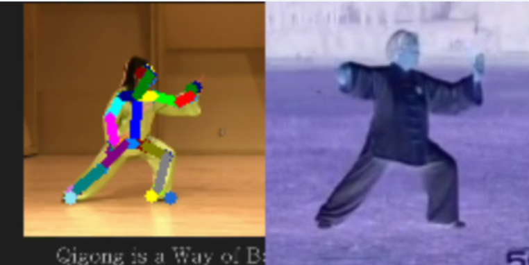
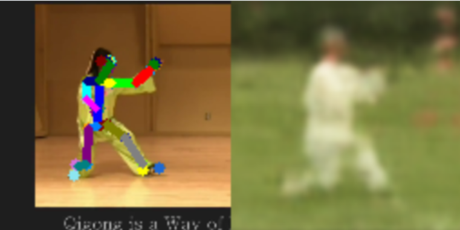
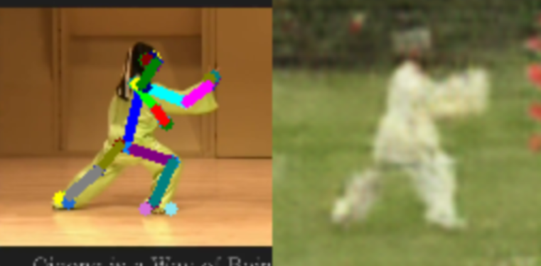
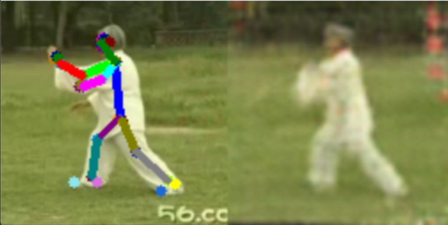

# Gesture transfer and person image generation 

> À partir d'une vidéo d'une personne source et d'une autre d'une personne, notre objectif est de générer une nouvelle vidéo de la cible effectuant les mêmes mouvements que la source.

Ce projet est basé sur le papier [Everybody Dance Now](https://arxiv.org/abs/1808.07371) et utilise le modèle [Mediapipe](https://mediapipe-studio.webapps.google.com/studio/demo/pose_landmarker) pour détecter et générer le squelette du corps.

Ce projet aborde trois approches différentes pour répondre à notre objectif :
- Calcul de la pose la plus proche de la personne à partir de la vidéo
- Utilisation d'un réseau de neurones pour générer la pose de la personne cible
- Utilisation d'un discrimateur similaire à l'architecture GAN pour améliorer la qualité de la vidéo générée

Les modèles pré-entrainés sont présents dans le dossier `models`. Sont presents :
- `DanceGenVanillaFromSke.pth` : Modèle pré-entrainé pour l'approche GenVanilla
- `DanceGenGAN.pth` : Modèle pré-entrainé pour l'approche GAN

# Exécution

Pour exécuter le projet, il suffit de lancer le script `DanceDemo.py`. Le paramètre GEN_TYPE permet de choisir l'approche à utiliser pour générer la vidéo.
- NEAREST = 1
- VANILLA_NN_SKE = 2
- VANILLA_NN_Image = 3 : Même implémentation que VANILLA_NN_SKE
- GAN = 4

```python
if __name__ == '__main__':
    # NEAREST = 1
    # VANILLA_NN_SKE = 2
    # VANILLA_NN_Image = 3
    # GAN = 4
    GEN_TYPE = 4
    ddemo = DanceDemo("data/taichi2.mp4", GEN_TYPE)
    # ddemo = DanceDemo("data/taichi1.mp4", GEN_TYPE)
    # ddemo = DanceDemo("data/karate1.mp4", GEN_TYPE)
    ddemo.draw()
```

Les scripts d'entrainement sont également exécutables en lançant les scripts `GenVanillaNN.py` et `GenGAN.py`.
Ces fichiers permettent d'entrainer les modèles et de les enregistrer (le nombre d'époques peut être variable).

PS : Il se peut également que les images d'entrainement en soient pas présentes dans le dossier `data`. Il sera alors nécessaire d'exécuter le script `VideoSkeleton.py` au préalable.

# GenNeirest

Cette approche consiste à calculer la pose la plus proche de la personne cible à partir de la vidéo de la personne source. Pour cela, nous calculons la distance entre le squelette de l'image source et celles des frames de la vidéo cible. Nous sélectionnons ensuite la pose la plus proche pour chaque frame de la vidéo cible.

## Résultats

Les résultats obtenus sont satisfaisants, mais la vidéo générée est saccadée et ne correspond pas parfaitement à la vidéo source.



## Limitations

Cette approche, en plus de ne pas donner un résultat fluide, n'est pas "générative". En effet, elle ne génère pas de nouvelles poses, mais sélectionne simplement les poses les plus proches de la vidéo cible.

# GenVanilla

Cette approche consiste à utiliser un réseau de neurones convolutif pour générer la pose de la personne cible. Pour cela, nous utilisons des couches de convolution pour apprendre les caractéristiques des poses de la personne source et les appliquer à la personne cible.

Le modèle est composé comme suit : 

```python
Sequential(
  (0): ConvTranspose2d(26, 128, kernel_size=(4, 4), stride=(1, 1))
  (1): BatchNorm2d(128, eps=1e-05, momentum=0.1, affine=True, track_running_stats=True)
  (2): ReLU(inplace=True)
  (3): ConvTranspose2d(128, 64, kernel_size=(4, 4), stride=(2, 2), padding=(1, 1))
  (4): BatchNorm2d(64, eps=1e-05, momentum=0.1, affine=True, track_running_stats=True)
  (5): ReLU(inplace=True)
  (6): ConvTranspose2d(64, 32, kernel_size=(4, 4), stride=(2, 2), padding=(1, 1))
  (7): BatchNorm2d(32, eps=1e-05, momentum=0.1, affine=True, track_running_stats=True)
  (8): ReLU(inplace=True)
  (9): ConvTranspose2d(32, 16, kernel_size=(4, 4), stride=(2, 2), padding=(1, 1))
  (10): BatchNorm2d(16, eps=1e-05, momentum=0.1, affine=True, track_running_stats=True)
  (11): ReLU(inplace=True)
  (12): ConvTranspose2d(16, 3, kernel_size=(4, 4), stride=(2, 2), padding=(1, 1))
  (13): Tanh()
)
```


## Résultats

Cela nous permet d'avoir un résultat plus fluide que la méthode précédente, mais la vidéo générée est loin d'être parfaite. 

En entrainant notre modèle sur 200 epochs, nous obtenons le résultat suivant :



## Limitations

Le modèle n'est pas suffisamment entrainé pour générer des poses de qualité. Nous parvenons à distinguer la silhouette de la personne, mais l'image n'est pas réalistes.

# GenGAN

Cette approche consiste à utiliser un réseau de neurones similaire à l'architecture GAN pour générer des poses de qualité. Pour cela, nous utilisons un générateur et un discriminateur pour améliorer la qualité des poses générées.

Le générateur est composé comme suit : 

`Generateur`
```python
Sequential(
  (0): ConvTranspose2d(26, 128, kernel_size=(4, 4), stride=(1, 1))
  (1): BatchNorm2d(128, eps=1e-05, momentum=0.1, affine=True, track_running_stats=True)
  (2): ReLU(inplace=True)
  (3): ConvTranspose2d(128, 64, kernel_size=(4, 4), stride=(2, 2), padding=(1, 1))
  (4): BatchNorm2d(64, eps=1e-05, momentum=0.1, affine=True, track_running_stats=True)
  (5): ReLU(inplace=True)
  (6): ConvTranspose2d(64, 32, kernel_size=(4, 4), stride=(2, 2), padding=(1, 1))
  (7): BatchNorm2d(32, eps=1e-05, momentum=0.1, affine=True, track_running_stats=True)
  (8): ReLU(inplace=True)
  (9): ConvTranspose2d(32, 16, kernel_size=(4, 4), stride=(2, 2), padding=(1, 1))
  (10): BatchNorm2d(16, eps=1e-05, momentum=0.1, affine=True, track_running_stats=True)
  (11): ReLU(inplace=True)
  (12): ConvTranspose2d(16, 3, kernel_size=(4, 4), stride=(2, 2), padding=(1, 1))
  (13): Tanh()
)
```
ps: Le générateur est le même que celui de l'approche GenVanilla.

`Discriminateur`

```python
Sequential(
  (0): Conv2d(3, 64, kernel_size=(4, 4), stride=(2, 2), padding=(1, 1), bias=False)
  (1): LeakyReLU(negative_slope=0.2, inplace=True)
  (2): Conv2d(64, 128, kernel_size=(4, 4), stride=(2, 2), padding=(1, 1), bias=False)
  (3): BatchNorm2d(128, eps=1e-05, momentum=0.1, affine=True, track_running_stats=True)
  (4): LeakyReLU(negative_slope=0.2, inplace=True)
  (5): Conv2d(128, 256, kernel_size=(4, 4), stride=(2, 2), padding=(1, 1), bias=False)
  (6): BatchNorm2d(256, eps=1e-05, momentum=0.1, affine=True, track_running_stats=True)
  (7): LeakyReLU(negative_slope=0.2, inplace=True)
  (8): Conv2d(256, 512, kernel_size=(4, 4), stride=(2, 2), padding=(1, 1), bias=False)
  (9): BatchNorm2d(512, eps=1e-05, momentum=0.1, affine=True, track_running_stats=True)
  (10): LeakyReLU(negative_slope=0.2, inplace=True)
  (11): Conv2d(512, 1, kernel_size=(4, 4), stride=(1, 1), bias=False)
  (12): Sigmoid()
)
```

## Résultats

Un entrainement de 200 epochs nous permet d'obtenir le résultat suivant :





## Implémentations

L'implémentation du modèle est la suivante et de la boucle d'apprentissage et grandement inspiré du tutoriel [PyTorch DCGAN Tutorial](https://pytorch.org/tutorials/beginner/dcgan_faces_tutorial.html).

La boucle d'apprentissage a légèrement été modifiée pour prendre en entrée les squelettes des images et non un simple bruit. Par ailleurs, la distance entre l'image générée et l'image réelle est calculée dans la fonction coût pour améliorer la qualité des images générées. Autrement, le modèle semble uniquement apprendre à générer des images trompeuses pour le discriminateur, sans pour autant associer le bon squelette à la bonne image.  

## Limitations

Bien que les résultats soient plus satisfaisants que les deux approches précédentes, la qualité des poses générées n'est pas parfaite. Nous pouvons distinguer la silhouette de la personne, mais l'image n'est pas réaliste.
Il serait intéressant d'entrainer le modèle sur un plus grand nombre d'epochs pour obtenir des résultats plus satisfaisants. Utiliser des images de meilleure qualité pourrait également améliorer la qualité des poses générées.


